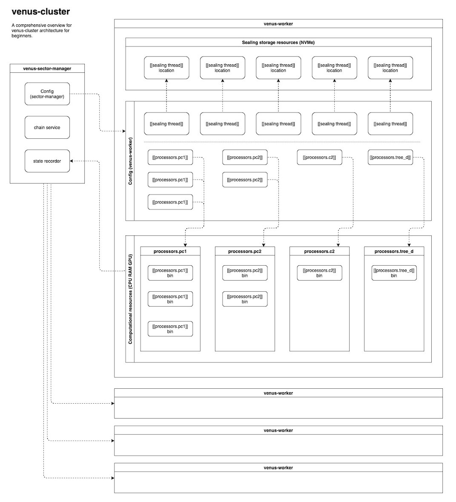

## Background

There have long been problems regarding how storage provider can maintain an efficient  and stable storage power services (sealing pipeline and PoSt workers). To name a few...

- Job scheduling issues where a centralized job scheduler would clog your sealing pipeline with too many tasks, wasting disk IO and network resources on unnecessary data transfer or fail to utilize your hardware to its full capacity
- Growth expansion issues where a storage provider would struggle in scaling its sealing pipeline and finding the optimal setup for newly added machines
- Custom code issues where a storage provider with programming background have to maintain a forked version of the reference implementation of Filecoin

venus-cluster is born given the above premises along with other pressing issues to help storage provider to alleviate and address these exact pain points.  

## Architecture of venus-cluster

The sealer subsystem, which is responsible for the growth and maintenance of storage power, is traditionally composed of either `lotus-miner` + `lotus-worker` or `venus-sealer` + `venus-worker`. In a Venus storage system, the sealer subsystem will be replaced by `venus-sector-manager` + `venus-worker`. Note that `venus-worker` compiled from `venus-cluster` project is completely different from the `venus-worker` compiled from `venus-sealer` project.

### Sealing pipeline optimization

There are a few key concepts of `venus-cluster` that fundamentally changed the architecture of a sealing pipeline that one has to be aware of.  

- One worker machine handles all phases of sealing where a sector will go through all phases of sealing on one worker machine
- Passive job scheduling where sector-manager passively receives task updates from worker while workers themselves actively seek out tasks to run
- Configurable resource management where the computation and storage resources could be planned and isolated for each sealing tasks through extensive configurations

### devOps optimization

With architectural changes of `venus-cluster`, it presents new streamlined ways of managing your storage system.

- Decoupling of Post tasks where you can deploy dedicated Post worker to avoid resource competition with your sealing tasks
- Uniformed and easy deployment where you can take configuration file of one worker and apply it to a new worker with same hardware specification to achieve same sealing capacity as the previous worker
- Fault tolerance and quicker diagnosis where smarter retry mechanism is implemented and locate errors faster in your sealing pipeline

### Configuration architecture

`venus-cluster` allows extensive configurations of worker’s planning and isolation of its computational resources (CPU, RAM, GPU) and its storage resources (SSD, NVMe).  Proper configuration of computational resources and storage resources would contribute to a highly efficient sealing pipeline. Most notably, [[processors]] configures the isolation of the computational resources on a `venus-worker` and [[sealing_thread]] configures the task control and isolation of storage resources on a `venus-worker`. This means that when you have one [[processors.pc1]] configured, `venus-worker` would allocate the configured computational resources for use of this pc1 process only. Similarly, when you have one [[sealing_thread]] configured, `venus-worker` will allocate a section of your storage resources for storing all temporary files when sealing a sector. 