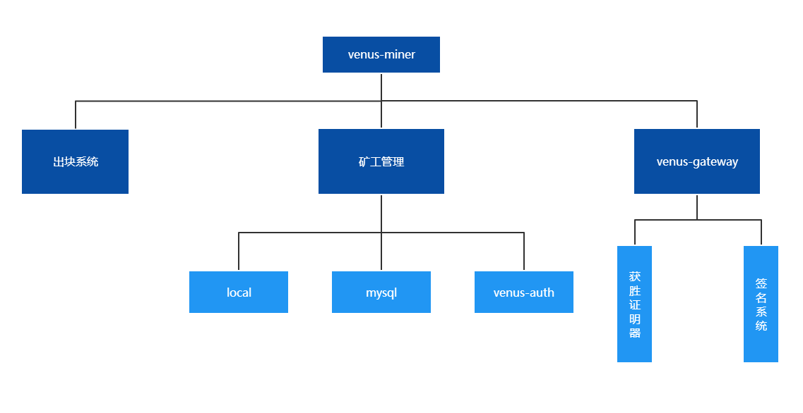
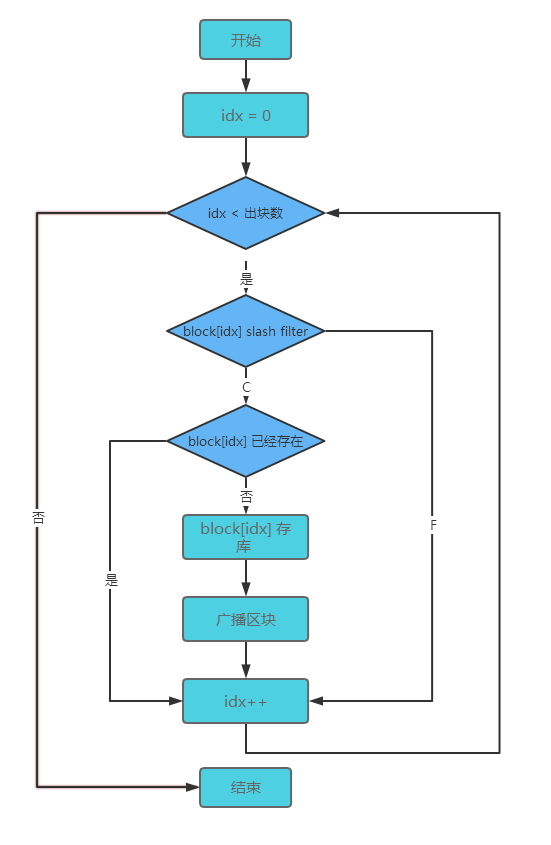

# venus-miner系统设计

## 系统架构

 &ensp;&ensp; Filecoin预期共识是决定在一个周期内由谁产生Block的协议。基于此协议，Filecoin网络中的miner更愿意投身于存储而并非计算能力。有效存储空间占全网总算力比例越大,竞争选票获胜的概率就越高。miner竞争出块是为了获得激励，即出块奖励。

 &ensp;&ensp; venus-sealer就是venus矿池服务层组件之一，负责矿工的出块。与PL实现的lotus不同的是：
 
 - venus-sealer支持多矿工出块，矿工的存取可以是本地，mysql或venus-auth（默认）；
 - 签名由venus-wallet负责；
 - 计算获胜证明由venus-sealer负责。
 
  &ensp;&ensp; venus-miner的架构图如下所示：

## 详细设计

 &ensp;&ensp; venus-miner主要流程包括：
 
 - 向venus-auth请求miner列表，程序运行中执行`venus-miner address update`可手动触发；
 - 获取最新base并更新lastBase，base数据包括上一轮的Tipset和空轮数；
 - 循环尝试每个miner出块，PL实现的lotus-miner只允许单矿工，及一个lotus-miner只负责一个miner的出块；
 - 从消息池选择待打包消息，这里我们根据获胜区块数选择对应个数的消息集合，尽量保证每个集合的消息不重复，以争取更多的区块小费及保证消息及时上链；
 - 创建区块；
 - 广播区块.
 
 
 
 ### 广播区块子流程
 
 - slash filter: （1）一个周期内出两个块； （2）共识错误：区块的parent和实际的不符；
 - 广播区块前先会在miner连接的venus节点进行本地验证，如果验证不通过，则不会想网络广播。
 
 

## 改进思路

 &ensp;&ensp; 这里的改进是针对社区版本出现的问题做优化，目的是为了不错过任何的出块机会，也就是不出孤块。
 
- 区块的广播需要一定的时间，特别是同步节点网络环境较差时，其延迟更加明显。社区版设置等待最新base的时间为6s，一旦6s内没有获取上一轮所有的出块，那及时本轮获得出块权也会因为重量较小而成为孤块；我们的改进方案是轮循base，在创建区块时选择最优base，可以这样做的原因是：

（1）出块权的计算不依赖所有的base，只要有一个即可；

（2）区块的ticket计算依赖的是父Tipset中最小的（MinTicket），故在创建区块时要选择最优base，不然可能不包含MinTicket所在的block。

- 实际上目前Filecoin网络中有很多miner改了出块逻辑，把等待上轮base时间设置的远远大于6s，毕竟做winingPoSt正常只需要不到10s。经常会看到某些矿工在周期开始后20多秒出的块也会被当做base块，如果竞选成功其block将比遵守等待6s
的出块多一个base block，其 weight 也会较大，结果就是别的miner的快被成了孤块。这种情况其实是不合理的，但在目前的逻辑下貌似无法避免。我们能做的也是跟着设置较长的等待时间或轮询base。
